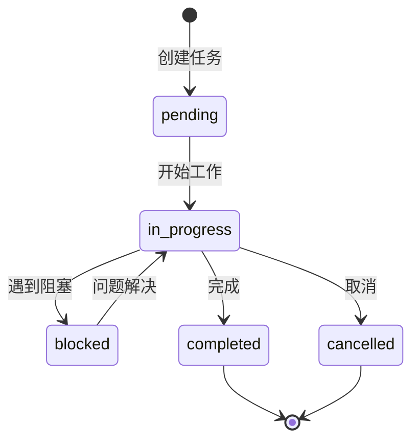

# CLAUDE.md

本文件为 Claude Code (claude.ai/code) 提供开发指导。

> **提示**: 本工作流与 Obsidian 知识库配合使用。运行 `/project-to-obsidian` 可自动生成项目知识库。

---

## 🧠 主脑 (Orchestrator) 与 Subagents 架构

### 角色定义

```
┌─────────────────────────────────────────────────────────────────────┐
│                        Claude Code 执行层                            │
├─────────────────────────────────────────────────────────────────────┤
│                                                                     │
│  ┌──────────────┐        分解        ┌──────────────────────────┐  │
│  │              │ ──────────────────▶│                          │  │
│  │   主脑       │   创建子任务       │   Subagent 1             │  │
│  │ Orchestrator │                    │   (任意类型)             │  │
│  │              │ ──────────────────▶│                          │  │
│  │ 职责：       │   委派执行         ├──────────────────────────┤  │
│  │ • 任务分解   │                    │                          │  │
│  │ • 策略制定   │ ──────────────────▶│   Subagent 2             │  │
│  │ • 质量把控   │   并行执行         │   (任意类型)             │  │
│  │ • 决策汇总   │                    │                          │  │
│  │ • 对外输出   │ ──────────────────▶├──────────────────────────┤  │
│  │              │   结果整合       │                          │  │
│  │              │ ◀─────────────────│   Subagent 3             │  │
│  │              │   返回结果         │   (任意类型)             │  │
│  └──────────────┘                    │                          │  │
│                                      └──────────────────────────┘  │
│                                                                     │
│  交互对象：用户                      交互对象：代码/系统/文档       │
│  上下文窗口：主上下文                 上下文窗口：隔离/专用          │
└─────────────────────────────────────────────────────────────────────┘
                              │
                              │ 读写
                              ▼
┌─────────────────────────────────────────────────────────────────────┐
│                        Obsidian 知识管理层                           │
├─────────────────────────────────────────────────────────────────────┤
│                                                                     │
│  ┌──────────────┐  ┌──────────────┐  ┌──────────────────────────┐  │
│  │   01-Tasks   │  │  02-Memories │  │      03-Context          │  │
│  │   任务状态   │  │   技术记忆   │  │     会话上下文           │  │
│  ├──────────────┤  ├──────────────┤  ├──────────────────────────┤  │
│  │ • 进行中     │  │ • 技术决策   │  │ • 当前会话状态           │  │
│  │ • 待办       │  │ • 经验教训   │  │ • 活跃任务引用           │  │
│  │ • 已完成     │  │ • 项目状态   │  │ • 临时工作区             │  │
│  └──────────────┘  └──────────────┘  └──────────────────────────┘  │
│                                                                     │
│  作用：持久化存储、跨会话共享、任务追踪、知识沉淀                    │
└─────────────────────────────────────────────────────────────────────┘
```

### 主脑 (Orchestrator) 职责

| 职责 | 说明 | 输出 |
|------|------|------|
| **任务分解** | 将用户请求分解为可并行/串行的子任务 | 子任务清单 |
| **策略制定** | 决定执行顺序、资源分配、Subagent 选型 | 执行计划 |
| **Subagent 委派** | 创建并分派任务给专用 Subagents | Agent 调用 |
| **质量把控** | 审核 Subagent 结果，确保符合标准 | 质量报告 |
| **决策汇总** | 整合多个 Subagent 的输出 | 综合结论 |
| **对外输出** | 向用户汇报，保持上下文连贯 | 最终响应 |
| **知识管理** | 与 Obsidian 交互，更新任务/记忆 | Markdown 文件 |

### Subagents

Subagents 是**专注于特定任务的专用智能体**。主脑根据任务需求动态选择合适的 Subagents。

**常见 Subagent 类型示例**:

| 类型 | 适用场景 |
|------|----------|
| **code-reviewer** | 代码质量审查 |
| **security-auditor** | 安全漏洞检查 |
| **tdd-guide** | 测试驱动开发 |
| **planner** | 架构规划 |
| **refactor-cleaner** | 代码重构 |
| **doc-updater** | 文档更新 |
| **explore** | 代码探索/分析 |

**注意**: 以上仅为示例。主脑应根据任务需求**灵活选择**任何类型的 Subagent，不受此列表限制。

### 协作模式

#### 模式 1: 串行审查

```
用户请求 → 主脑分析 → Subagent A → Subagent B → 主脑汇总 → 用户
                │          (分析)      (审查)      │
                │              │          │       │
                └──────────────┴──────────┘       │
                          结果整合                  │
```

#### 模式 2: 并行执行

```
                    ┌→ Subagent A (分析)
用户请求 → 主脑分析 ┼→ Subagent B (审查)
                    ├→ Subagent C (测试)
                    └→ Subagent D (文档)
                              ↓
                         主脑汇总
                              ↓
                           用户
```

#### 模式 3: 层级分解

```
复杂请求 → 主脑 (Orchestrator)
              │
              ├→ Sub-Planner (规划子任务)
              │       │
              │       ├→ Subagent A
              │       ├→ Subagent B
              │       └→ Subagent C
              │
              └→ 整合结果 → 用户
```

---

## 📋 Obsidian 任务与记忆管理工作流

> Obsidian 作为主脑与 Subagents 共享的知识库，实现任务状态同步和知识沉淀。

### 工作流架构

```
┌──────────────────────────────────────────────────────────────────────────┐
│                              用户层                                      │
│                         (需求/反馈/确认)                                  │
└──────────────────────────────────────────────────────────────────────────┘
                                    │
                                    │ 输入
                                    ▼
┌──────────────────────────────────────────────────────────────────────────┐
│                            主脑层 (Orchestrator)                         │
│  ┌───────────────────────────────────────────────────────────────────┐   │
│  │  1. 解析用户意图                                                  │   │
│  │  2. 检索 Obsidian 记忆/任务                                       │   │
│  │  3. 制定执行策略                                                  │   │
│  │  4. 分解为子任务                                                  │   │
│  │  5. 选择合适的 Subagents                                          │   │
│  └───────────────────────────────────────────────────────────────────┘   │
│                                    │                                    │
│                   ┌────────────────┼────────────────┐                   │
│                   │                │                │                   │
│         委派任务  │        委派任务 │         委派任务 │                   │
│                   ▼                ▼                ▼                   │
└──────────────────────────────────────────────────────────────────────────┘
                                    │
                                    │ 并行/串行执行
                                    ▼
┌──────────────────────────────────────────────────────────────────────────┐
│                           Subagents 执行层                               │
│                                                                          │
│  ┌─────────────┐  ┌─────────────┐  ┌─────────────┐  ┌─────────────┐     │
│  │             │  │             │  │             │  │             │     │
│  │ Subagent A  │  │ Subagent B  │  │ Subagent C  │  │ Subagent D  │     │
│  │ (任意类型)   │  │ (任意类型)   │  │ (任意类型)   │  │ (任意类型)   │     │
│  └──────┬──────┘  └──────┬──────┘  └──────┬──────┘  └──────┬──────┘     │
│         │                │                │                │            │
│         └────────────────┴────────────────┴────────────────┘            │
│                                    │                                    │
│                              返回结果                                    │
└──────────────────────────────────────────────────────────────────────────┘
                                    │
                                    ▼
┌──────────────────────────────────────────────────────────────────────────┐
│                            主脑层 (Orchestrator)                         │
│  ┌───────────────────────────────────────────────────────────────────┐   │
│  │  1. 审核 Subagent 结果                                            │   │
│  │  2. 整合多维度输出                                                │   │
│  │  3. 质量把控                                                      │   │
│  │  4. 必要时循环修正                                                │   │
│  │  5. 生成最终输出                                                  │   │
│  └───────────────────────────────────────────────────────────────────┘   │
└──────────────────────────────────────────────────────────────────────────┘
                                    │
                    ┌───────────────┴───────────────┐
                    │                               │
                    ▼                               ▼
┌──────────────────────────────┐    ┌──────────────────────────────┐
│        输出给用户             │    │     更新 Obsidian            │
│    (最终响应/报告)            │    │  (任务状态/技术记忆/日志)      │
└──────────────────────────────┘    └──────────────────────────────┘
```

### 主脑 ↔ Obsidian 交互

```
主脑 (Orchestrator)
       │
       ├── 读取 ──▶ 01-Tasks/active/     (加载当前任务)
       │
       ├── 读取 ──▶ 02-Memories/        (检索相关记忆)
       │
       ├── 读取 ──▶ 03-Context/         (获取会话上下文)
       │
       │              │
       │              │ (执行任务...)
       │              │
       │              ▼
       │
       ├── 写入 ──▶ 01-Tasks/active/     (更新任务状态)
       │
       ├── 写入 ──▶ 02-Memories/         (保存新记忆)
       │
       ├── 写入 ──▶ 03-Context/          (更新上下文)
       │
       └── 写入 ──▶ 05-Daily/            (记录日志)
```

### Subagent ↔ Obsidian 交互

```
Subagent (只读访问)
       │
       ├── 读取 ──▶ 01-Tasks/active/{task-id}.md   (了解任务详情)
       │
       ├── 读取 ──▶ 02-Memories/technical/        (获取技术上下文)
       │
       └── 读取 ──▶ 04-Reference/                 (参考代码片段)

       (Subagent 不直接写入 Obsidian，通过主脑统一更新)
```

### 工作流阶段

#### Stage 1: 任务规划 (主脑 + Obsidian)

1. **主脑**接收用户请求
2. **主脑**查询 Obsidian `01-Tasks/` 检查是否存在相关任务
3. **主脑**搜索 Obsidian `02-Memories/` 加载相关技术记忆
4. **主脑**分析任务复杂度，决定是否需要 Subagents
5. **主脑**创建/更新任务文件到 Obsidian

#### Stage 2: 记忆检索 (主脑 + Obsidian)

```
主脑查询:
- "[[相关主题]]" → 技术记忆
- "status:in_progress" → 活跃任务
- "context:相关上下文" → 相关上下文
```

#### Stage 3: Subagent 委派 (主脑 → Subagents)

主脑根据任务类型和复杂度，**灵活选择**合适的 Subagents:

| 任务类型 | 主脑决策 | 可能的 Subagent 组合 |
|----------|----------|---------------------|
| 新功能开发 | 需要规划+测试+审查 | 规划类 → 测试类 → 审查类 |
| Bug修复 | 需要定位+验证 | 分析类 + 审查类 |
| 代码重构 | 需要影响分析+文档 | 分析类 → 重构类 → 文档类 |
| 复杂设计 | 需要架构审查 | 架构类 → 审查类 |

**原则**:
- 主脑根据任务需求**动态决定**使用哪些 Subagents
- 不预设固定的 Subagent 组合
- 支持自定义 Subagent 类型

#### Stage 4: 结果审核 (主脑)

1. **主脑**接收 Subagent 结果
2. **主脑**验证结果质量
3. **主脑**判断是否需要迭代
4. 如需迭代 → 返回 Stage 3
5. 如通过 → 进入 Stage 5

#### Stage 5: 知识沉淀 (主脑 + Obsidian)

1. **主脑**更新任务状态 (`status: completed`)
2. **主脑**追加实施日志到任务文件
3. **主脑**创建/更新技术记忆 (如有新决策)
4. **主脑**更新今日日志
5. **主脑**清理 `03-Context/current-session.md`

### 任务状态流转



### Obsidian 目录结构

```
Obsidian Vault/
│
├── .obsidian/                  # Obsidian 配置
│   └── plugins/               # Dataview, Tasks, Templater
│
├── 00-Inbox/                  # 收件箱 (任何人可写)
│   ├── quick-notes.md
│   └── unprocessed/
│
├── 01-Tasks/                  # 任务管理 (主脑读写, Subagents只读)
│   ├── active/               # 进行中任务
│   ├── backlog/              # 待办任务
│   ├── completed/            # 已完成任务
│   ├── recurring/            # 周期性任务
│   └── 📑 Task Index.md      # 任务索引 MOC
│
├── 02-Memories/               # 记忆管理 (主脑读写, Subagents只读)
│   ├── project/              # 项目级记忆
│   ├── technical/            # 技术决策
│   ├── feedback/             # 反馈与教训
│   └── 🔗 Memory Index.md    # 记忆索引 MOC
│
├── 03-Context/                # 上下文管理 (主脑读写, 会话隔离)
│   ├── current-session.md    # 当前会话上下文
│   ├── active-branches.md    # 活跃分支
│   └── research-notes/       # 研究笔记
│
├── 04-Reference/              # 参考资料 (只读, 人人可访问)
│   ├── api-snippets/         # API 代码片段
│   ├── patterns/             # 设计模式
│   └── external/             # 外部资源
│
├── 05-Daily/                  # 日志 (主脑写, 回顾时读)
│   └── 2025/
│       └── 05/
│           ├── 2025-05-08.md
│           └── 📓 Daily Index.md
│
└── 06-Agents/                 # Agent 工作区 (Subagents读写, 主脑协调)
    ├── agent-a/              # Subagent A 工作区
    ├── agent-b/              # Subagent B 工作区
    ├── agent-c/              # Subagent C 工作区
    └── shared/               # Agent 共享空间
```

### 访问权限矩阵

| 目录 | 主脑 (Orchestrator) | Subagents | 用户 |
|------|---------------------|-----------|------|
| `00-Inbox/` | 读写 | 只读 | 读写 |
| `01-Tasks/` | **读写** | **只读** | 读写 |
| `02-Memories/` | **读写** | **只读** | 读写 |
| `03-Context/` | **读写** | 隔离 | 读写 |
| `04-Reference/` | 只读 | 只读 | 读写 |
| `05-Daily/` | **写** | - | 读写 |
| `06-Agents/` | **协调** | **读写** | - |

---

## 任务管理规范

### 任务文件模板

**位置**: `01-Tasks/active/task-{YYYYMMDD}-{task-name}.md`

```markdown
---
title: "任务标题"
id: "TASK-YYYYMMDD-001"
created: "YYYY-MM-DD HH:00"
status: "in_progress"  # pending / in_progress / blocked / completed / cancelled
priority: "high"       # critical / high / medium / low
category: "bugfix"     # feature / bugfix / refactor / research / docs
estimate: "2h"         # 预估时间
actual: ""             # 实际耗时
claude_session: ""     # Claude Code 会话 ID
related_memories:
  - "[[相关记忆1]]"
  - "[[相关记忆2]]"
---

# 任务标题

## 🎯 目标
描述任务要解决的问题。

## 📋 成功标准
- [ ] 标准 1
- [ ] 标准 2
- [ ] 标准 3

## 🔍 上下文

### 相关代码/文件
- `path/to/file1` - 说明
- `path/to/file2` - 说明

### 历史背景
描述相关历史决策或问题背景。

## 💭 决策记录

### YYYY-MM-DD HH:MM - 决策标题
决策描述：...
选择方案 X，原因：...

## 📝 实施日志

### Step 1: 步骤标题
- [x] 子任务 1
- [ ] 子任务 2

### Step 2: 步骤标题
- [ ] 子任务 1
- [ ] 子任务 2

## 🏷️ 标签
#tag1 #tag2 #tag3
```

### 任务查询 (Dataview)

**位置**: `01-Tasks/📑 Task Index.md`

```markdown
# 任务索引

## 🔥 进行中
```dataview
table status, priority, created, estimate
from "01-Tasks/active"
where status = "in_progress"
sort priority desc, created asc
```

## ⏳ 待办
```dataview
table priority, created, estimate
from "01-Tasks/backlog"
sort priority desc, created asc
```

## ✅ 最近完成
```dataview
table completed_date, actual
from "01-Tasks/completed"
sort completed_date desc
limit 10
```

## 📊 统计
- 进行中: `length(filter(file.inlinks, (f) => f.status = "in_progress"))`
- 本月完成: `length(filter(file.inlinks, (f) => f.completed_date >= date(today) - dur(30 days)))`
```

---

## 记忆管理规范

### 记忆文件模板

**位置**: `02-Memories/technical/{topic-name}.md`

```markdown
---
title: "决策标题"
created: "YYYY-MM-DD"
updated: "YYYY-MM-DD"
type: "technical-decision"  # technical-decision / feedback / project-state
importance: "high"            # critical / high / medium / low
context: "相关上下文"
related_tasks:
  - "[[task-YYYYMMDD-task-name]]"
---

# 决策标题

## 决策背景
描述为什么需要做此决策。

## 对比分析

| 选项 | 优点 | 缺点 |
|------|------|------|
| 方案 A | ... | ... |
| 方案 B | ... | ... |

## 关键发现

### 发现 1
描述关键发现。

### 发现 2
描述关键发现。

## 实施经验

### ✅ 成功经验
- 经验 1
- 经验 2

### ⚠️ 注意事项
- 注意 1
- 注意 2

## 相关代码/文件
- `path/to/file` - 说明

## 🏷️ 标签
#tag1 #tag2
```

### 记忆类型定义

| 类型 | 用途 | 示例 |
|------|------|------|
| **technical-decision** | 技术决策记录 | 为什么选择 X 而非 Y |
| **project-state** | 项目状态快照 | 当前架构决策 |
| **feedback** | 反馈与教训 | 上次重构的经验 |
| **api-pattern** | API 设计模式 | 如何设计数据管道 |
| **debug-solution** | 调试解决方案 | 常见问题修复 |

### 记忆检索

**位置**: `02-Memories/🔗 Memory Index.md`

```markdown
# 记忆索引

## 🔧 技术决策
```dataview
table created, updated, importance
from "02-Memories/technical"
sort updated desc
```

## 📋 项目状态
```dataview
table created, context
from "02-Memories/project"
sort created desc
```

## 🎓 经验教训
```dataview
table created, related_tasks
from "02-Memories/feedback"
sort created desc
```

## 🔍 快速搜索
### 按主题
- [[#performance]]
- [[#architecture]]
- [[#design]]
- [[#data-processing]]
```

---

## 每日日志规范

### 日志模板

**位置**: `05-Daily/YYYY/MM/YYYY-MM-DD.md`

```markdown
---
date: "YYYY-MM-DD"
day_of_week: "周X"
---

# YYYY-MM-DD 工作日志

## 🎯 今日目标
- [ ] 任务 1
- [ ] 任务 2
- [ ] 任务 3

## 📝 工作记录

### HH:00-HH:00 任务标题
- 工作内容
- 相关任务: [[task-YYYYMMDD-task-name]]

## 💭 今日思考
今日的发现或思考。

## 🔗 引用记忆
- [[memory-name]] - 引用说明

## 📊 统计
- 完成任务: X
- 发现问题: X
- 代码提交: X
```

---

## Claude Code 与 Obsidian 集成

### Subagent 工作空间

```
06-Agents/                    # Agent 专用工作区
├── agent-a/                  # Subagent A 工作区
│   ├── workspace/           # 工作文件 (临时)
│   ├── templates/           # 任务模板
│   └── history/             # 执行历史
│
├── agent-b/                  # Subagent B 工作区
│   ├── workspace/
│   ├── checklists/          # 检查清单
│   └── reports/             # 输出报告
│
├── agent-c/                  # Subagent C 工作区
│   ├── workspace/
│   ├── templates/
│   └── patterns/
│
└── shared/                   # Agent 共享空间
    ├── snippets/            # 共享代码片段
    ├── utils/               # 共享工具
    └── docs/                # Agent 文档
```

**规则**:
- Subagent 在 `06-Agents/{agent-name}/workspace/` 中工作
- Subagent 可读取 `01-Tasks/`, `02-Memories/`, `04-Reference/`
- Subagent 将结果返回主脑，**不直接写入**知识库
- 主脑审核后统一更新到 `01-Tasks/`, `02-Memories/`

### 任务委派示例

**主脑创建任务文件**:

```markdown
---
title: "审查配置修复"
assignee: "code-reviewer"
parent_task: "[[task-YYYYMMDD-fix-config]]"
---

# 审查配置修复

## 审查范围
- `path/to/file1`
- `path/to/file2`

## 关注点
- [ ] 配置传递是否正确
- [ ] 是否有副作用
- [ ] 是否符合设计模式

## 结果
<!-- Subagent 填写 -->
```

**主脑委派**:
```python
# 主脑创建并启动 Subagent
# 主脑根据任务需要灵活选择 subagent_type
Agent({
    description: "审查配置修复",
    prompt: "请审查以下代码修改...\n\n任务文件: 06-Agents/{agent-name}/workspace/task-001.md",
    subagent_type: "{selected-subagent-type}"  # 主脑根据任务选择
})
```

**Subagent 返回结果**:
```markdown
## 审查结果

### 发现的问题
1. 问题 1 ✓
2. 问题 2 ✓
3. 建议改进点

### 建议
- 建议 1
- 建议 2
```

**主脑整合**:
- 主脑读取 Subagent 结果
- 决定是否采纳建议
- 更新主任务文件
- 如需进一步行动，创建新 Subagent 任务

### 工作流命令

在 Claude Code 会话中使用以下命令与 Obsidian 交互：

#### 任务管理

```bash
# 创建新任务
obsidian create path="01-Tasks/active/task-$(date +%Y%m%d)-{task-name}.md" \
  content="# {Task Title}\n\n## 🎯 目标\n..." \
  vault="{your-vault}"

# 更新任务状态
obsidian property:set name="status" value="completed" \
  file="task-YYYYMMDD-task-name" \
  vault="{your-vault}"

# 追加任务日志
obsidian append file="task-YYYYMMDD-task-name" \
  content="\n\n### $(date +%H:%M) 完成\n- 完成内容"
```

#### 记忆管理

```bash
# 创建技术决策记忆
obsidian create path="02-Memories/technical/{decision-name}.md" \
  content="# {Decision Title}\n\n## 决策\n..." \
  vault="{your-vault}"

# 更新记忆
obsidian append file="memory-name" \
  content="\n\n## $(date +%Y-%m-%d) 更新\n新的发现：..."
```

#### 日志管理

```bash
# 创建今日日志
obsidian create path="05-Daily/$(date +%Y)/$(date +%m)/$(date +%Y-%m-%d).md" \
  content="# $(date +%Y-%m-%d) 工作日志\n\n..." \
  vault="{your-vault}"
```

### Claude Code 技能集成

在 Claude Code 中使用 `project-to-obsidian` 技能自动生成/更新知识库：

```bash
# 分析项目并更新 Obsidian 知识库
/project-to-obsidian

# 这将自动：
# 1. 扫描项目结构
# 2. 分析依赖关系
# 3. 生成 Markdown 笔记
# 4. 更新 Obsidian 知识库
```

---

## 会话工作流示例

### 完整会话流程

```
用户: "帮我修复配置问题，这个配置在不同环境下表现不一致"

┌─────────────────────────────────────────────────────────────────────┐
│ 主脑 (Orchestrator)                                                │
├─────────────────────────────────────────────────────────────────────┤
│                                                                     │
│ 1. 🔍 检索 Obsidian                                                │
│    ├── 读取 01-Tasks/active/ → 检查是否有相关任务                  │
│    ├── 搜索 02-Memories/ → [[相关主题]]                            │
│    └── 读取 03-Context/ → 加载当前会话上下文                      │
│                                                                     │
│ 2. 📋 任务分析                                                     │
│    ├── 判断：这是配置传递问题                                    │
│    ├── 决策：需要分析 + 审查                                     │
│    └── 创建任务：01-Tasks/active/task-YYYYMMDD-fix-config.md     │
│                                                                     │
│ 3. 🤖 委派 Subagents                                               │
│    ├── 创建 Subagent A → 分析/定位问题                            │
│    ├── 创建 Subagent B → 审查/验证方案                            │
│    └── 创建 Subagent C → 测试/运行验证                            │
│                                                                     │
└─────────────────────────────────────────────────────────────────────┘
                                    │
                                    │ Subagent 并行执行
                                    ▼
┌─────────────────────────────────────────────────────────────────────┐
│ Subagent A (分析类)                      Subagent B (审查类)        │
│                                                                      │
│ 分析：                                  审查：                      │
│ - 定位问题代码                          - 确认修改点                 │
│ - 识别根本原因                          - 检查副作用                │
│ - 提出解决方案                          - 评估测试覆盖              │
│                                                                      │
│ 输出：                                  输出：                     │
│ "问题原因分析"                          "修改安全，建议添加测试"     │
└─────────────────────────────────────────────────────────────────────┘
                                    │
                                    │ 返回结果
                                    ▼
┌─────────────────────────────────────────────────────────────────────┐
│ 主脑 (Orchestrator)                                                │
├─────────────────────────────────────────────────────────────────────┤
│                                                                     │
│ 4. 🔍 审核 Subagent 结果                                           │
│    ├── Subagent A 分析准确 ✓                                       │
│    ├── Subagent B 审查通过 ✓                                       │
│    └── 决策：可以继续实施                                          │
│                                                                     │
│ 5. 💻 执行修复                                                     │
│    ├── 修改相关文件                                                │
│    └── 运行测试验证                                                │
│                                                                     │
│ 6. 🤖 委派验证 Subagent                                            │
│    └── 创建 Subagent C → 运行测试/验证                              │
│                                                                     │
└─────────────────────────────────────────────────────────────────────┘
                                    │
                                    │ 测试结果
                                    ▼
┌─────────────────────────────────────────────────────────────────────┐
│ Subagent C (验证类)                                                  │
│                                                                      │
│ 执行：                                                             │
│ - 运行测试套件                                                     │
│ - 覆盖率检查                                                       │
│                                                                      │
│ 输出：                                                             │
│ "测试通过，覆盖率达标"                                             │
└─────────────────────────────────────────────────────────────────────┘
                                    │
                                    ▼
┌─────────────────────────────────────────────────────────────────────┐
│ 主脑 (Orchestrator)                                                │
├─────────────────────────────────────────────────────────────────────┤
│                                                                     │
│ 7. 📝 更新 Obsidian                                                │
│    ├── 更新任务状态 → completed                                    │
│    ├── 追加实施日志到任务文件                                      │
│    ├── 创建技术记忆（如有新发现）                                  │
│    └── 更新今日日志                                                │
│                                                                     │
│ 8. 🎯 向用户汇报                                                   │
│    ├── 总结修复内容                                                │
│    ├── 提供相关 Obsidian 链接                                      │
│    └── 建议后续行动                                                │
│                                                                     │
└─────────────────────────────────────────────────────────────────────┘

用户收到：修复完成的总结报告 + Obsidian 任务链接
```

### 自动化钩子

建议配置的自动化：

1. **会话开始时 (主脑执行)**
   - 读取 `03-Context/current-session.md`
   - 加载活跃任务列表 (查询 `01-Tasks/active/`)
   - 检索相关记忆 (搜索 `02-Memories/`)

2. **任务完成时 (主脑执行)**
   - 更新任务文件状态
   - 如需要，移动到 `completed` 目录
   - 生成任务总结摘要

3. **会话结束时 (主脑执行)**
   - 更新 `03-Context/current-session.md`
   - 创建/更新今日日志 (`05-Daily/`)
   - 保存会话关键决策到 `02-Memories/`

4. **Subagent 执行时**
   - Subagent **只读**访问 Obsidian（通过主脑提供的上下文）
   - Subagent **不直接写入** Obsidian
   - Subagent 结果返回主脑统一处理

---

## 行为规范

1. **编码前思考**：明确权衡，有疑问时询问
2. **简洁优先**：不添加推测性功能，不过早抽象
3. **精准修改**：只修改必要内容，保持现有风格
4. **目标导向**：定义可验证的成功标准

---

*本文件与 Obsidian 知识库配合使用。运行 `/project-to-obsidian` 可自动生成项目知识库。*
